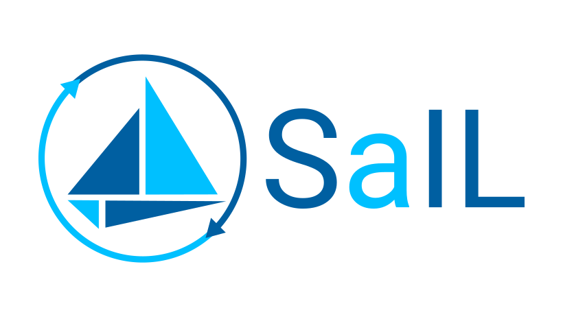

SAIL aims at improving safety in Reactive Domain Specific Languages. It is a simple imperative programming language with support for synchronous concurrent processes. By synchronous, we mean that processes share a logical clock as in Esterel like-language. Processes are cooperative, communicate through shared memory and synchronize by means of broadcasted signals.
As Esterel and Fairthread/C, SAIL is control oriented. Causality issues are put aside by delaying reaction to absences as in Fairthread/C.

SAIL stands for SAfe Interactive Language

The long term objectives are :

- safe, garbage collection free, memory handling with an ownership type system
  (largely inspired by the rust type system, but with a specific management of shared memory better suited to cooperative programming)
- efficient parallel scheduling of memory independent processes
- program proof support

The language propose the following features :

- ground data types, structures and enumeration
- imperative methods
- parallel composition of processes
- cooperative processes which may
  - emit signal, execute on behalf of a signal and preempt on behalf of a signal
  
The grammar of the language can be found in 'grammar.bnf' and several examples are provided in 'examples'.
To test SAIL you need an ocaml toolchain (ocaml compiler, dune and some additional packages)

- clone the repository
- run 'dune build' and then 'dune install'
- you can compile a file 'filename.sl' using the command sailc filename.sl
- you can run the test by using the script 'runtest.sh' in 'examples'

type sailc --help for more options
